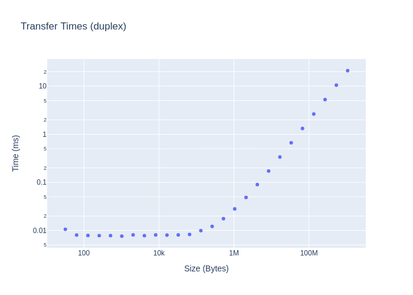

# NVLINK

See also: https://github.com/NVIDIA/nccl-tests

```txt
GPU 0: NVIDIA RTX A6000 (UUID: GPU-5baec991-de63-c196-1766-04c38407e133)
	 Link 0: 14.062 GB/s
	 Link 1: 14.062 GB/s
	 Link 2: 14.062 GB/s
	 Link 3: 14.062 GB/s
GPU 1: NVIDIA RTX A6000 (UUID: GPU-39fc2446-cb50-2067-2867-d95efd470a2c)
	 Link 0: 14.062 GB/s
	 Link 1: 14.062 GB/s
	 Link 2: 14.062 GB/s
	 Link 3: 14.062 GB/s
GPU 2: NVIDIA RTX A6000 (UUID: GPU-02c05ee3-bdb5-aac7-f9e8-a4c8f3f725b3)
NVML: Unable to retrieve NVLink information as all links are inActive
```



Device: NVIDIA RTX A6000

To figure out connectivity:
```
> nvidia-smi topo -m
	GPU0	GPU1	GPU2	CPU Affinity	NUMA Affinity
GPU0	 X 	NV4	NODE	0-31,64-95	0
GPU1	NV4	 X 	NODE	0-31,64-95	0
GPU2	NODE	NODE	 X 	0-31,64-95	0

Legend:

  X    = Self
  SYS  = Connection traversing PCIe as well as the SMP interconnect between NUMA nodes (e.g., QPI/UPI)
  NODE = Connection traversing PCIe as well as the interconnect between PCIe Host Bridges within a NUMA node
  PHB  = Connection traversing PCIe as well as a PCIe Host Bridge (typically the CPU)
  PXB  = Connection traversing multiple PCIe bridges (without traversing the PCIe Host Bridge)
  PIX  = Connection traversing at most a single PCIe bridge
  NV#  = Connection traversing a bonded set of # NVLinks
```

```bash
> nvidia-smi nvlink -s
GPU 0: NVIDIA RTX A6000 (UUID: GPU-5baec991-de63-c196-1766-04c38407e133)
	 Link 0: 14.062 GB/s
	 Link 1: 14.062 GB/s
	 Link 2: 14.062 GB/s
	 Link 3: 14.062 GB/s
GPU 1: NVIDIA RTX A6000 (UUID: GPU-39fc2446-cb50-2067-2867-d95efd470a2c)
	 Link 0: 14.062 GB/s
	 Link 1: 14.062 GB/s
	 Link 2: 14.062 GB/s
	 Link 3: 14.062 GB/s
GPU 2: NVIDIA RTX A6000 (UUID: GPU-02c05ee3-bdb5-aac7-f9e8-a4c8f3f725b3)
NVML: Unable to retrieve NVLink information as all links are inActive
```

Results after NVLINK warmup:

```txt
Transfer check passed
Size: 32.0B Time: 10μs BW (duplex): 3.09161 MB/s
Size: 64.0B Time: 8μs BW (duplex): 8.14112 MB/s
Size: 128.0B Time: 7μs BW (duplex): 16.6335 MB/s
Size: 256.0B Time: 7μs BW (duplex): 33.5223 MB/s
Size: 512.0B Time: 7μs BW (duplex): 67.0445 MB/s
Size: 1.0KB Time: 7μs BW (duplex): 137.428 MB/s
Size: 2.0KB Time: 8μs BW (duplex): 258.908 MB/s
Size: 4.1KB Time: 7μs BW (duplex): 537.043 MB/s
Size: 8.2KB Time: 8μs BW (duplex): 1036.91 MB/s
Size: 16.4KB Time: 8μs BW (duplex): 2091.92 MB/s
Size: 32.8KB Time: 8μs BW (duplex): 4147.64 MB/s
Size: 65.5KB Time: 8μs BW (duplex): 8105.91 MB/s
Size: 131.1KB Time: 9μs BW (duplex): 13516.4 MB/s
Size: 262.1KB Time: 12μs BW (duplex): 22057.1 MB/s
Size: 524.3KB Time: 17μs BW (duplex): 30504 MB/s
Size: 1.0MB Time: 28μs BW (duplex): 38170.7 MB/s
Size: 2.1MB Time: 48μs BW (duplex): 44150.6 MB/s
Size: 4.2MB Time: 90μs BW (duplex): 47658.8 MB/s
Size: 8.4MB Time: 172μs BW (duplex): 49875.1 MB/s
Size: 16.8MB Time: 336μs BW (duplex): 51018.5 MB/s
Size: 33.6MB Time: 665μs BW (duplex): 51626.3 MB/s
Size: 67.1MB Time: 1321μs BW (duplex): 51989.6 MB/s
Size: 134.2MB Time: 2638μs BW (duplex): 52091.3 MB/s
Size: 268.4MB Time: 5268μs BW (duplex): 52172.9 MB/s
Size: 536.9MB Time: 10520μs BW (duplex): 52254.6 MB/s
Size: 1.1GB Time: 21029μs BW (duplex): 52284.6 MB/s
```
