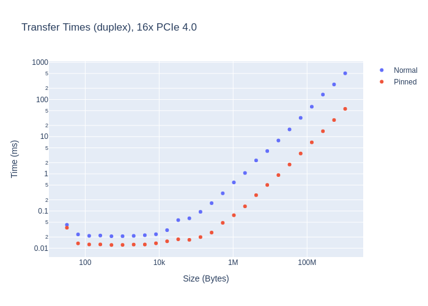

# PCIe

NVIDIA A100-SXM4-40GB 16x PCIe 4.0:


Device: NVIDIA A100-SXM4-40GB

To lookup PCIe version and number of lanes used, run:
```bash
> lspci | grep -i nvidia
06:00.0 3D controller: NVIDIA Corporation Device 20b0 (rev a1)
```

```bash
> lspci -vvv -s 06:00.0 | grep -i 'LnkCap\|LnkSta'
LnkCap:	Port #0, Speed 16GT/s, Width x16, ASPM not supported
LnkSta:	Speed 16GT/s (ok), Width x16 (ok)
LnkSta2: Current De-emphasis Level: -6dB, EqualizationComplete+, EqualizationPhase1+
```

16GT/s tells you that you are using PCIe 4.0 (check [Wikipedia](https://en.wikipedia.org/wiki/PCI_Express) for more info

Results will depend on (among other things):
- PCIe version
- Number of lanes used
- CPU governor settings (set to performance)

Results after PCIe warmup:

```txt
Device: NVIDIA A100-SXM4-40GB
------- Running PCIe Normal ------

Size: 32.0B Time: 23μs BW (Dev to Host): 1.38724 MB/s
Size: 64.0B Time: 25μs BW (Dev to Host): 2.5589 MB/s
Size: 128.0B Time: 23μs BW (Dev to Host): 5.53514 MB/s
Size: 256.0B Time: 20μs BW (Dev to Host): 12.597 MB/s
Size: 512.0B Time: 20μs BW (Dev to Host): 25.6488 MB/s
Size: 1.0KB Time: 20μs BW (Dev to Host): 50.6314 MB/s
Size: 2.0KB Time: 21μs BW (Dev to Host): 97.406 MB/s
Size: 4.1KB Time: 21μs BW (Dev to Host): 195.448 MB/s
Size: 8.2KB Time: 22μs BW (Dev to Host): 373.325 MB/s
Size: 16.4KB Time: 29μs BW (Dev to Host): 563.353 MB/s
Size: 32.8KB Time: 36μs BW (Dev to Host): 913.269 MB/s
Size: 65.5KB Time: 60μs BW (Dev to Host): 1112.36 MB/s
Size: 131.1KB Time: 92μs BW (Dev to Host): 1445.21 MB/s
Size: 262.1KB Time: 162μs BW (Dev to Host): 1656.58 MB/s
Size: 524.3KB Time: 295μs BW (Dev to Host): 1813.84 MB/s
Size: 1.0MB Time: 580μs BW (Dev to Host): 1849.84 MB/s
Size: 2.1MB Time: 1169μs BW (Dev to Host): 1835.85 MB/s
Size: 4.2MB Time: 2164μs BW (Dev to Host): 1984.62 MB/s
Size: 8.4MB Time: 4375μs BW (Dev to Host): 1963.38 MB/s
Size: 16.8MB Time: 7740μs BW (Dev to Host): 2219.34 MB/s
Size: 33.6MB Time: 16516μs BW (Dev to Host): 2080.38 MB/s
Size: 67.1MB Time: 31501μs BW (Dev to Host): 2181.44 MB/s
Size: 134.2MB Time: 66628μs BW (Dev to Host): 2062.76 MB/s
Size: 268.4MB Time: 130832μs BW (Dev to Host): 2100.99 MB/s
Size: 536.9MB Time: 259506μs BW (Dev to Host): 2118.47 MB/s
Size: 1.1GB Time: 533140μs BW (Dev to Host): 2062.33 MB/s

----- Running PCIe Pinned ------

Size: 32.0B Time: 18μs BW (each direction): 1.73057 MB/s
Size: 64.0B Time: 12μs BW (each direction): 4.94973 MB/s
Size: 128.0B Time: 12μs BW (each direction): 10.3888 MB/s
Size: 256.0B Time: 12μs BW (each direction): 20.4 MB/s
Size: 512.0B Time: 12μs BW (each direction): 42.5567 MB/s
Size: 1.0KB Time: 12μs BW (each direction): 84.9158 MB/s
Size: 2.0KB Time: 12μs BW (each direction): 168.421 MB/s
Size: 4.1KB Time: 12μs BW (each direction): 328.97 MB/s
Size: 8.2KB Time: 12μs BW (each direction): 662.247 MB/s
Size: 16.4KB Time: 15μs BW (each direction): 1054.24 MB/s
Size: 32.8KB Time: 16μs BW (each direction): 1942.38 MB/s
Size: 65.5KB Time: 16μs BW (each direction): 3974.29 MB/s
Size: 131.1KB Time: 19μs BW (each direction): 6673.73 MB/s
Size: 262.1KB Time: 28μs BW (each direction): 9358.94 MB/s
Size: 524.3KB Time: 46μs BW (each direction): 11224.1 MB/s
Size: 1.0MB Time: 74μs BW (each direction): 14169.6 MB/s
Size: 2.1MB Time: 128μs BW (each direction): 16298.4 MB/s
Size: 4.2MB Time: 238μs BW (each direction): 17574 MB/s
Size: 8.4MB Time: 456μs BW (each direction): 18358.3 MB/s
Size: 16.8MB Time: 894μs BW (each direction): 18748.7 MB/s
Size: 33.6MB Time: 1777μs BW (each direction): 18878.3 MB/s
Size: 67.1MB Time: 3529μs BW (each direction): 19013.6 MB/s
Size: 134.2MB Time: 7016μs BW (each direction): 19129.5 MB/s
Size: 268.4MB Time: 14015μs BW (each direction): 19152.6 MB/s
Size: 536.9MB Time: 27995μs BW (each direction): 19176.9 MB/s
Size: 1.1GB Time: 55959μs BW (each direction): 19187.9 MB/s

----- Running PCIe Pinned Write Combined ------

Size: 32.0B Time: 21μs BW (Dev to Host): 1.52268 MB/s
Size: 64.0B Time: 15μs BW (Dev to Host): 4.27223 MB/s
Size: 128.0B Time: 12μs BW (Dev to Host): 10.1527 MB/s
Size: 256.0B Time: 16μs BW (Dev to Host): 16.0825 MB/s
Size: 512.0B Time: 16μs BW (Dev to Host): 31.3738 MB/s
Size: 1.0KB Time: 24μs BW (Dev to Host): 42.5041 MB/s
Size: 2.0KB Time: 30μs BW (Dev to Host): 69.2335 MB/s
Size: 4.1KB Time: 61μs BW (Dev to Host): 68.1325 MB/s
Size: 8.2KB Time: 95μs BW (Dev to Host): 87.8103 MB/s
Size: 16.4KB Time: 187μs BW (Dev to Host): 89.6157 MB/s
Size: 32.8KB Time: 17μs BW (Dev to Host): 1955.27 MB/s
Size: 65.5KB Time: 15μs BW (Dev to Host): 4202.18 MB/s
Size: 131.1KB Time: 20μs BW (Dev to Host): 6694.15 MB/s
Size: 262.1KB Time: 27μs BW (Dev to Host): 9804.07 MB/s
Size: 524.3KB Time: 47μs BW (Dev to Host): 11422.8 MB/s
Size: 1.0MB Time: 74μs BW (Dev to Host): 14474.4 MB/s
Size: 2.1MB Time: 128μs BW (Dev to Host): 16668.9 MB/s
Size: 4.2MB Time: 238μs BW (Dev to Host): 18031.3 MB/s
Size: 8.4MB Time: 457μs BW (Dev to Host): 18773.9 MB/s
Size: 16.8MB Time: 895μs BW (Dev to Host): 19182.7 MB/s
Size: 33.6MB Time: 1775μs BW (Dev to Host): 19352.7 MB/s
Size: 67.1MB Time: 3528μs BW (Dev to Host): 19473.5 MB/s
Size: 134.2MB Time: 7025μs BW (Dev to Host): 19564.1 MB/s
Size: 268.4MB Time: 14014μs BW (Dev to Host): 19614 MB/s
Size: 536.9MB Time: 27996μs BW (Dev to Host): 19636.6 MB/s
Size: 1.1GB Time: 55958μs BW (Dev to Host): 19648.8 MB/s
```
